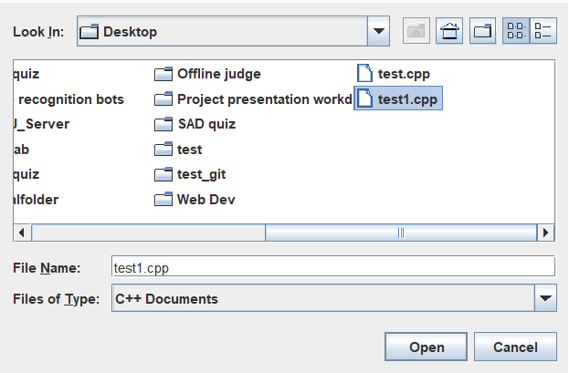

# IUTForces
IUTForces is an offline programming judge application made as the Lab project for CSE 4402: Visual Programming Lab and CSE 4408: System Analysis and Design Lab.

## Team Members:
* Syed Rifat Raiyan- 180041205
* Ishrak Hossain- 180041218
* Md. Maksudul Haque- 180041222

## Foreword:
The main goal of this application is to make the whole weekly Lab Task Evaluation process automatic.

## Admin Features:
### Initiating Server:
Start the server using a valid port number.

### Login/Signup:
Lab Instructors can create a new Admin account or login to an already existing account.

### Add Problems:
Lab Instructors can add a new problem by providing the Problem Statement, the inputs and the expected outputs.

### Delete Problems:
Lab Instructors can delete any problem that was previously added from his account and also delete the submissions of that problem.

### View List of Problems Added:
Lab Instructors can view all the problems added from his account.

### View Status of All Students:
Lab Instructors can view the Submission Status of all the students can can choose to click on a Submission ID to further inspect the submitted source code.

### View Rank-list:
Lab Instructors can view the Standings of all the students. The list is sorted based on the number of problems solved in descending order.

## User Features:
### Login/Signup:
Students can create a new User account or login to an already existing one.

### View Problem Statement:
Students can click on the Problem Title ot Problem ID of a problem listed on the Problems tab and view its Problem Statement, Time Limit and Memory Limit.

### Submit Solution:
Students can navigate to the Submit Solution tab and submit their source codes. They can choose to directly paste their code in the blank text area or upload the .c, .cpp or .java file.

### View Own Submission History:
Students can navigate to the My Submissions tab and see their own submission history. They can view the source code by clicking on the submission ID.

### View Rank-list:
Students can view the Standings table to know about the number of problem they managed to solve. The list is sorted based on the number of problems solved in descending order.

## Common Features:
### View Problemset:
Both students and teachers can see the list of all the problems. They can open the respective Problem Statements simply by clicking on the Problem Title or Problem ID.

### View Status Table:
Both students and teachers can view the status table where all students' submissions are listed and the verdict of those submissions can also be seen. Teachers can further inspect all the submissions while the students do not have that privilege.

## Incomplete Features:
### Clarifications:
Students can directly communicate with the teachers to clear up any confusion they might have regarding the problem statements. It will be a mini chatting application.

### Tutorial Section:
Teachers can choose to add a text file explaining the approach(es) to solve the given Lab tasks. The students can view them after the Lab ends to get an idea about how they can solve the problems.

## Resources:
### Tutorials:
* [Basic Java Tutorial by Programming with Mosh](https://www.youtube.com/watch?v=eIrMbAQSU34&t=6991s)
* [Java Swing Tutorial by Telusko](https://www.youtube.com/playlist?list=PLsyeobzWxl7pVZdyDXj0arOdTzo4MYekh)

### Inspirations:
We were inspired by similar projects like:
* [PC2](https://github.com/ishtupeed/miscellaneous/tree/master/JAVA-Project/PC2) by [Bakhtiar Hasan](https://github.com/ishtupeed) sir.
* IUT Offline Judge by [Kawsar Ahmed](https://github.com/k4w54r) bhai and [Asaduzzaman Herok](https://github.com/ASADUZZAMAN-HEROK) bhai.
* [KU Offline Judge](https://github.com/fardinabir/CSEKU_SDP_2019_OFFLINE_JUDGE) by [Fardin Abir](https://github.com/fardinabir).
* [Online Judge](https://github.com/AnikSarker/CSE-202-Term-Project-Online-Judge) by [Anik Sarker](https://github.com/AnikSarker).
